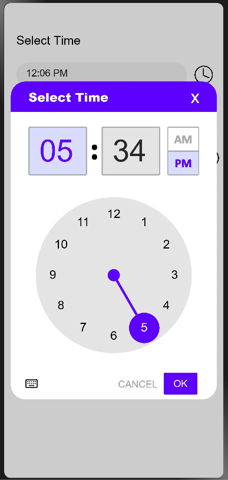
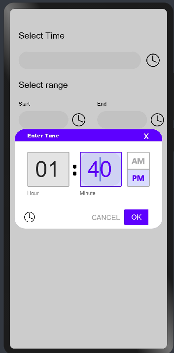
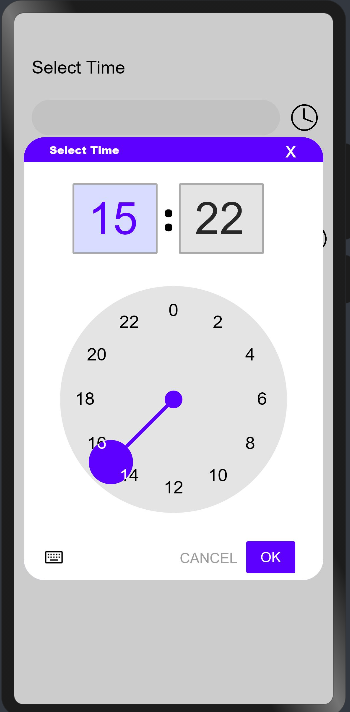
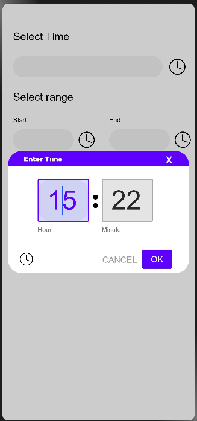

# Time Picker
****
Time pickers help users select and set a specific time.
## Dependencies
****
For using MaterialTimePicker in your app, add the below dependency in the entry/package.json  
```
"dependencies": {
    "@ohos/materialtimepicker": "file:../MaterialTimePicker"
 }
```
Add dependency command with
```
npm i @ohos/materialtimepicker
```
## Usage instructions
****
Import these components and data types
```
import { MaterialTimePicker, TimeFormat, InputMethod } from "@ohos/materialtimepicker"
```
## Screenshots
****
 
 

## How to use it
***
### Imports
Import the following components and data types
```
import { MaterialTimePicker, TimeFormat, InputMethod } from "@ohos/materialtimepicker"
```
### Code
To pickup from the Time Picker
```

MaterialTimePicker({
                  options: {
                    timeFormat: TimeFormat.CLOCK_24H,
                    hour:10,
                    minute:30,
                    cancel: [this.cancel],
                    onPositiveButtonClick: [(time: string) => this.submit2(time)],
                    onNegativeButtonClick:[this.cancel],
                    dismiss:[this.cancel],
                    keyboardSymbol: $r("app.media.keyboard"),
                    clockSymbol:$r("app.media.clock"),
                    clockFaceBackgroundColor:Color.Pink,
                    clockHandColor:Color.Green,
                    inputMethod:InputMethod.TextInputMethod,
                    clockNumberTextColor:Color.Red,
                    textInputTitle:"SELECT YOUR TIME",
                    clockInputTitle:"Enter your Time",
                    titleBackgroundColor:Color.Yellow,
                    titleFontColor:Color.White,
                    labelColor:Color.Red,
                    materialCircleRadius:200,
                    selectorSize:60
                  }
    })
```

## Styling
****
You can style the viewer using these attributes :

| Attribute  | Description  |
| ------------ | ------------ |
| timeFormat | sets the 12H or 24H format   |
| hour | sets the initial value of hour   |
| minute | sets the initial value of minute   |
| cancel | list of callback functions to call on cancelling the time picker   |
| onPositiveButtonClick | list of callback functions to call on clicking OK button   |
| onNegativeButtonClick | list of callback functions to call on clicking cancel button   |
| dismiss | list of callback functions to call on dismissing the timepicker   |
| keyboardSymbol  | Symbol for the keyboard icon |
| clockSymbol  | symbol for the clock icon  |
| clockFaceBackgroundColor  | sets the color of the background of clock's face  |
| clockHandColor   |  sets the color of clock's hand |
| inputMethod | sets the initial Input Method   |
| clockNumberTextColor | sets the color of clock's elements  |
| textInputTitle | sets the title of the Time Picker screen in Text Input Mode   |
| clockInputTitle | sets the title of the Time Picker screen in Clock Input Mode   |
| titleBackgroundColor | sets the background color of the title  |
| titleFontColor | sets the font color of the title  |
| labelColor | sets the font color of the label in text input mode  |
| materialCircleRadius | sets the radius indicating how far away from the center of the group the elements are positioned  |
| selectorSize | sets the diameter of the pointer of the clock hand |

## Compatibility
****
Supports OpenHarmony API version 9
## Code Contribution
****
If you find any problems during usage, you can submit an [issue](https://github.com/Applib-OpenHarmony/MaterialTimePicker/issues) to us. Of course, we also welcome you to send us PR.
## Open source License
****
This project is based on [Apache License 2.0](./LICENSE), please enjoy and participate in open source freely.

